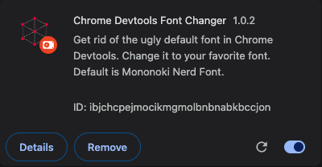

### How to setup
- Clone or download this repo to you computer
- Open [Chrome Extension Manager](chrome://extensions/)
- Click on **Load unpacked** button on top (if you can not find this button, please enable **Developer mode** from top )
- Select the folder where you cloned or downloaded this repo

After selecting, you will see this extension in your extension list.

- Reopen devtool to see effect. All monospaced font should be changed to **Mononoki Nerd Font** if this font installed to your machine. Otherwise, you can change the font name in [devtools.css](devtools/devtools.css)

### Thanks to
- [ArmaniCh/github-code-font-changer](https://github.com/AmraniCh/github-code-font-changer)
- [vbsessa/chrome-devtools.md](https://gist.github.com/vbsessa/e337d0add70a71861b8c580d5e16996e)